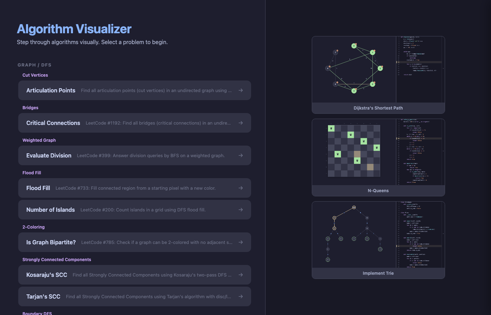
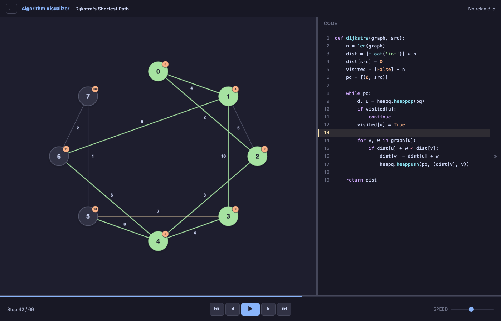
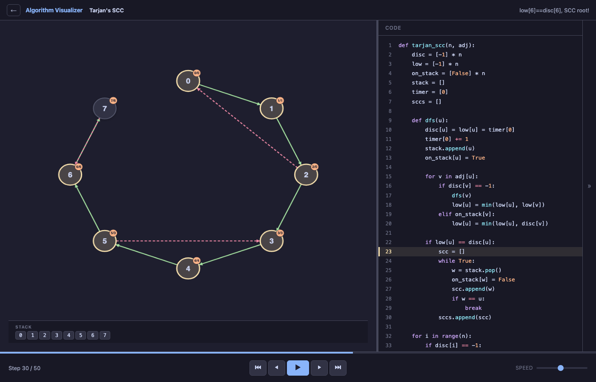
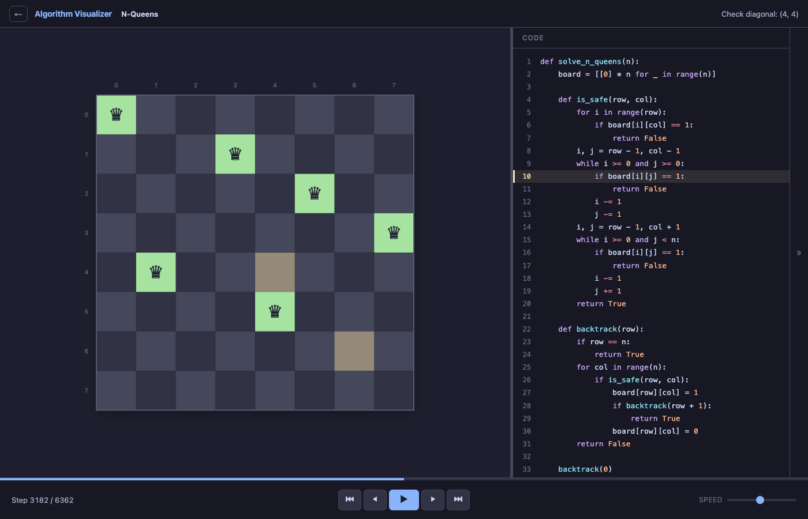
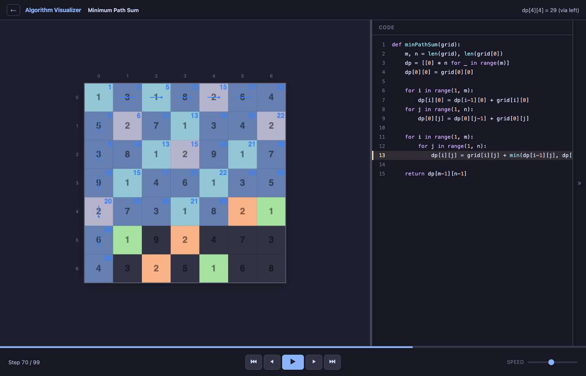
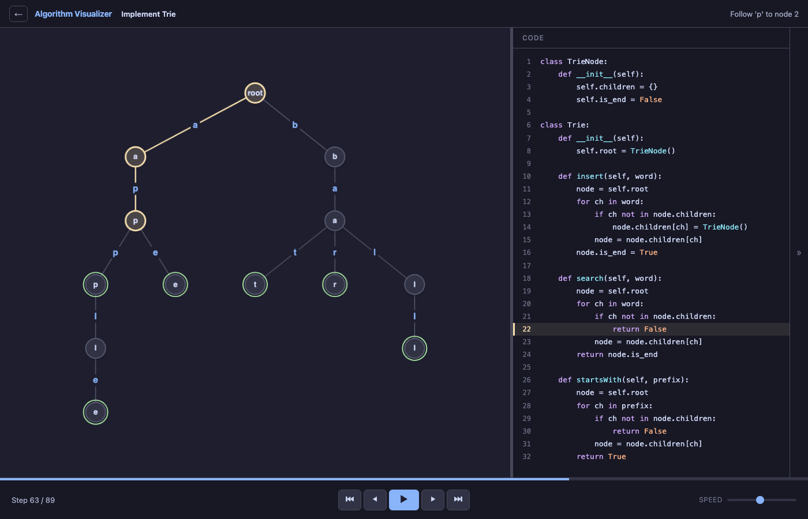
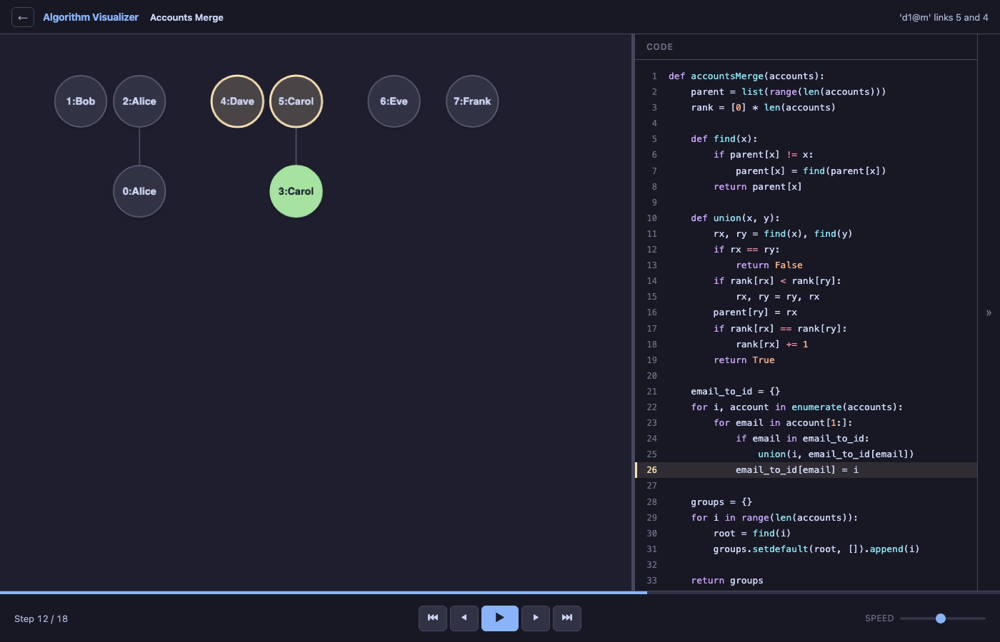

# Algorithm Visualizer

Interactive step-through visualizer for 42 algorithm problems covering graphs, grids, union-find, tries, and more.

**Live demo**: [visualized-algorithms.up.railway.app](https://visualized-algorithms.up.railway.app/)



## Screenshots

| Dijkstra's Shortest Path | Tarjan's SCC |
|:---:|:---:|
|  |  |

| N-Queens | Minimum Path Sum |
|:---:|:---:|
|  |  |

| Implement Trie | Accounts Merge (DSU) |
|:---:|:---:|
|  |  |

## Features

- **42 problems** across 7 topics, auto-discovered from `problems/*.py`
- **6 renderer types**: board, graph, array, DSU forest, trie tree, auxiliary panels
- **Weighted graph support**: edge weights/labels, Bezier curves, edge classification (tree/back/cross/forward)
- **Node badges**: disc/low annotations for Tarjan-style algorithms
- **Board overlays**: DP distance values, directional arrows, path highlighting
- **Auxiliary panels**: queue/stack/visited-set visualization below the main canvas
- **DSU forest view**: parent-child tree layout with union/find animation
- **Trie renderer**: character-labeled edges, end-of-word markers
- Playback controls: start/back/play/forward/end + speed slider + click-to-seek progress bar
- Keyboard shortcuts: Space (play/pause), Left/Right (step), Home/End (first/last), Esc (back)
- Resizable code panel with syntax highlighting and active-line tracking
- Collapsible log drawer (rolling window, capped to 50 entries per step)
- **Mobile-responsive**: swipeable Visualize/Code tabs, touch-friendly controls, proportional canvas scaling

## Quick start

```bash
python3 -m venv venv
source venv/bin/activate
pip install -r requirements.txt
python3 main.py
```

Opens at `http://localhost:5050`.

## Deployment

Hosted on [Railway](https://railway.app) with gunicorn. Configured via `Procfile` and `runtime.txt`.

## Project structure

```text
visualize_algo/
  main.py                     # Flask app + API
  requirements.txt
  Procfile                    # Railway/gunicorn config
  runtime.txt                 # Python version for Railway
  core/
    step.py                   # Step/CellState/GraphNode/GraphEdge/DSUNode/TrieNode dataclasses
    tracer.py                 # Mutable tracers -> frozen snapshots
  problems/
    base_problem.py           # Problem interface
    registry.py               # Dynamic discovery
    *.py                      # 42 problem implementations
  templates/
    index.html                # App shell
  static/
    css/style.css
    js/
      app.js                  # App orchestration + API wiring
      player.js               # Playback engine
      code_panel.js           # Source viewer + line highlight
      renderers/
        board.js              # 2D grid renderer (overlays, arrows, path glow)
        graph.js              # Graph renderer (weights, badges, edge classes, groups)
        array.js              # 1D array renderer
        dsu.js                # DSU forest-of-trees renderer
        trie.js               # Trie tree renderer
        aux_panel.js          # Auxiliary panel renderer (DOM-based)
```

## Implemented problems (42)

### DFS / BFS Grid
- Flood Fill (#733), Number of Islands (#200), Rotting Oranges (#994)
- Shortest Path in Binary Matrix (#1091), Surrounded Regions (#130), Walls and Gates (#286)
- N-Queens (backtracking)

### Board Overlay / DP
- Word Search (#79), Unique Paths (#62), Minimum Path Sum (#64)
- Pacific Atlantic Water Flow (#417), 01 Matrix (#542)

### Graph / Topological
- Course Schedule (#207), Course Schedule II (#210)
- Is Graph Bipartite? (#785), Number of Provinces (#547), Redundant Connection (#684)
- Alien Dictionary (#269), Task Scheduler (#621)

### Weighted Graph
- Dijkstra's Shortest Path, Bellman-Ford, Floyd-Warshall, Prim's MST
- Network Delay Time (#743), Cheapest Flights K Stops (#787), Max Probability Path (#1514)

### Union Find (DSU)
- Accounts Merge (#721), Equality Equations (#990)
- Kruskal's MST, Making A Large Island (#827), Swim in Rising Water (#778)

### Tarjan / SCC
- Tarjan's SCC, Kosaraju's SCC
- Critical Connections (#1192), Articulation Points

### Trie
- Implement Trie (#208), Add and Search Words (#211), Word Search II (#212)

### Auxiliary Panel Problems
- Level Order Traversal (#102), Evaluate Division (#399)
- Open the Lock (#752), Sliding Puzzle (#773)

## Backend API

### `GET /api/problems`
Returns problem list with metadata: `name`, `topic`, `subtopic`, `description`, `long_description`, `renderer_type`, `default_params`.

### `POST /api/run`
```json
{ "problem": "Dijkstra's Shortest Path", "params": {} }
```
Returns `source_code`, `renderer_type`, and `steps[]`. Responses are compressed (`br`/`gzip`) when supported.

## Core architecture

### Step model
`core/step.py` defines frozen snapshot dataclasses:
- **Board**: `CellState[][]` with overlay text, arrows, path markers
- **Array**: `ArrayCell[]`
- **Graph**: `GraphNode[]` (badges, groups) + `GraphEdge[]` (weights, labels, edge classes, curves)
- **DSU**: `DSUNode[]` (parent, rank, label)
- **Trie**: `TrieNode[]` + `TrieEdge[]`
- **Aux panels**: `AuxPanel[]` with selectable items

Each step carries `line_number`, `description`, and `log_messages`.

### Tracers
`core/tracer.py` provides mutable tracer helpers:
- `Board2DTracer` — grid state with overlays, arrows, path markers
- `Array1DTracer` — 1D array with pointers
- `GraphTracer` — nodes/edges with weights, badges, edge classification, layered layout
- `DSUTracer` — union-find forest with parent/rank tracking
- `TrieTracer` — trie tree with automatic layout
- `AuxPanelTracer` — composable auxiliary data panels

Call `snapshot(line, description)` to freeze current state into a `Step`.

## Add a new problem

1. Create `problems/<name>.py` with a class extending `Problem`.
2. Implement static methods: `name()`, `topic()`, `subtopic()`, `description()`, `source_code()`, `renderer_type()`, `generate_steps()`.
3. Discovery is automatic on server restart.

## Known limitations

- No UI controls for overriding `default_params`.
- No automated tests.
- Large traces (e.g. N-Queens n=8) produce heavy payloads.
